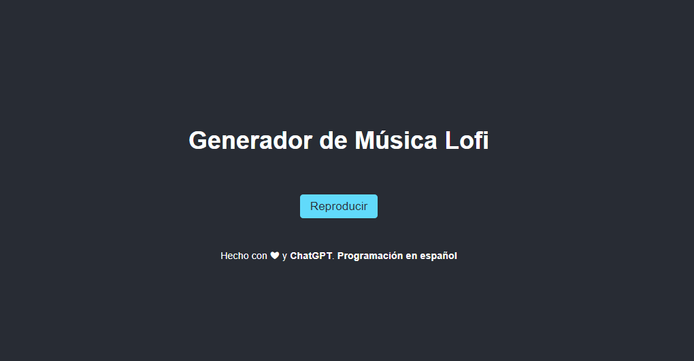

# [Lofi PoC with ChatGPT+GPT-4](https://programacion-es.dev)

    
    <h1>Programación en español</h1>

## Preview

## About

### Powered by ToneJS and ChatGPT

This project was developed entirely using ChatGPT prompt in order to try the power of GPT-4 engine and prompt iteration for code completion and generation.

## [Demo]()

## Join the community

    
    
    
    
    
    
    

